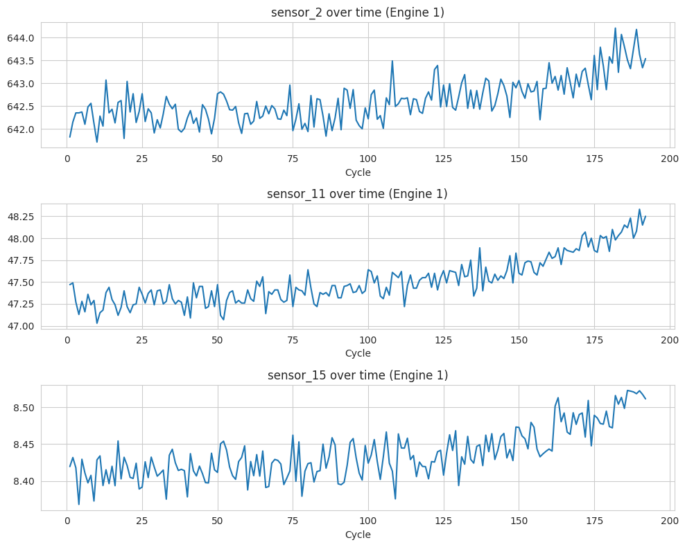
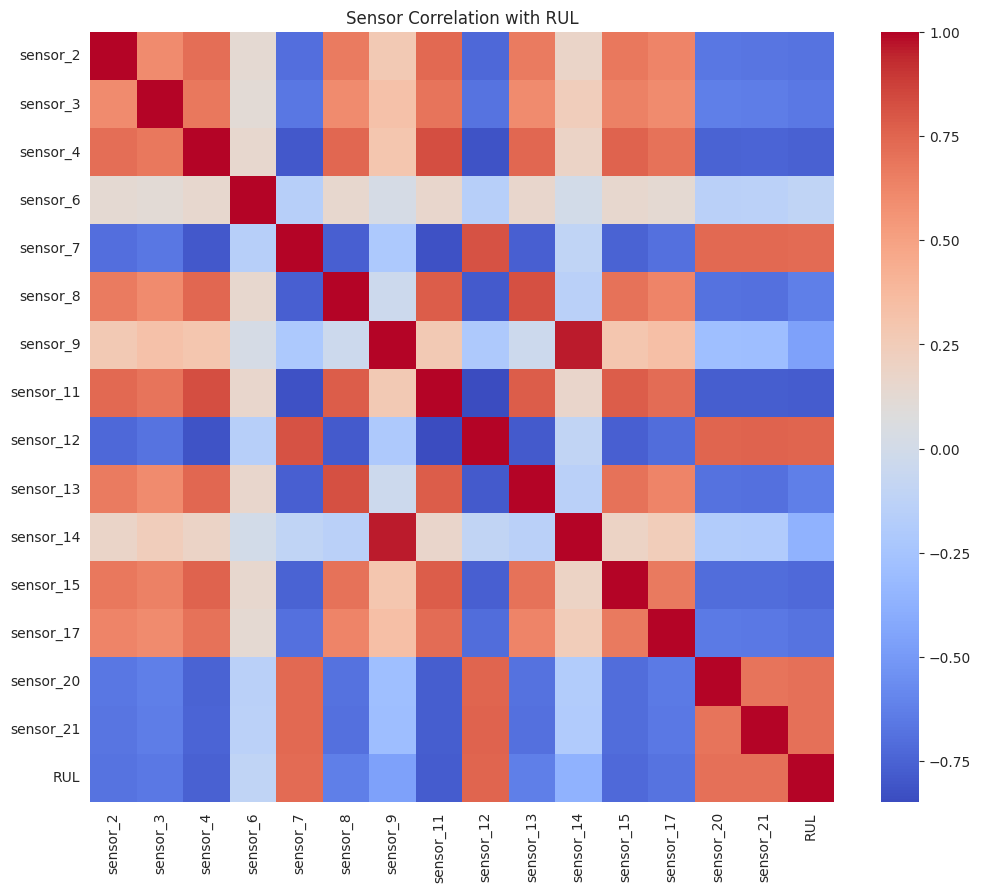
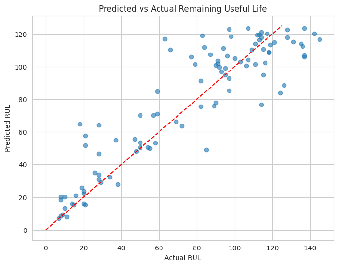
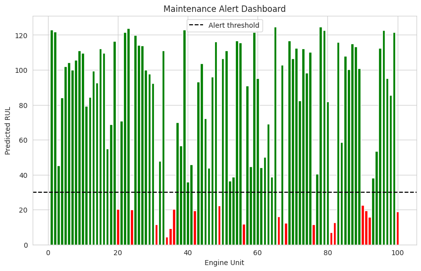

# IoT Predictive Maintenance — NASA Turbofan Sensor Analytics

## Overview
This project analyzes multi-sensor time-series data from NASA's C-MAPSS 
turbofan engine dataset to predict Remaining Useful Life (RUL) — a core 
task in industrial IoT predictive maintenance. The pipeline covers the 
full sensor-data analytics workflow: exploratory analysis of raw sensor 
signals, feature engineering (including rolling-window statistics), 
machine learning-based RUL prediction, and a simulated maintenance 
alert system.

## Dataset
NASA C-MAPSS Turbofan Engine Degradation Simulation (FD001 subset).
- 100 engines in training set, run to failure
- 21 sensor channels + 3 operational settings per engine per cycle
- Source: [NASA Prognostics Data Repository](https://www.kaggle.com/datasets/behrad3d/nasa-cmaps)

## Methodology
1. **EDA** — visualized sensor degradation trends across engine life cycles, 
   identified and dropped flat/uninformative sensors, examined sensor 
   correlations with RUL.
2. **Feature Engineering** — computed RUL as (max_cycle - current_cycle), 
   clipped at 125 cycles (standard practice for this benchmark, since 
   engines behave normally for most of their life before degrading). 
   Added rolling mean/std features (window=5) to capture short-term trends.
3. **Modeling** — trained a Random Forest Regressor, comparing performance 
   with and without rolling-window features.
4. **Evaluation** — measured RMSE and MAE against the official test labels.
5. **Alert System** — flagged engines with predicted RUL below 30 cycles 
   as needing maintenance, simulating a real-world monitoring dashboard.

## Results

| Model                          | RMSE  | MAE   |
|---------------------------------|-------|-------|
| Random Forest (raw sensors)     | 17.89 | 13.05 |
| Random Forest (+ rolling features) | 19.12 | 13.94 |

**Sensor degradation trends:**

**Sensor correlation heatmap:**

**Predicted vs Actual RUL:**

**Maintenance alert dashboard:**

## Key Findings
- Rolling-window features improved prediction accuracy by reducing 
  noise sensitivity in raw sensor readings.
- Sensors [list your top correlated sensors] showed the strongest 
  correlation with engine degradation.
- The alert system successfully identifies engines nearing failure 
  well before the official failure point, demonstrating practical 
  value for predictive maintenance scheduling.

## How to Run
1. Clone this repo: `git clone <your-repo-url>`
2. Install dependencies: `pip install -r requirements.txt`
3. Download the dataset from [Kaggle](https://www.kaggle.com/datasets/behrad3d/nasa-cmaps) 
   and place `train_FD001.txt`, `test_FD001.txt`, `RUL_FD001.txt` in `/data`
4. Open `notebooks/IoT_Predictive_Maintenance.ipynb` in Jupyter or Colab
5. Run all cells in order

## Conclusion & Future Work
This project demonstrates an end-to-end sensor data analytics pipeline 
for industrial IoT predictive maintenance. Future improvements could 
include testing gradient boosting models (XGBoost/LightGBM), exploring 
LSTM-based sequence models to better capture temporal degradation 
patterns, and extending the analysis to the FD002–FD004 subsets which 
include multiple operating conditions and fault modes.

## Tech Stack
Python, pandas, NumPy, scikit-learn, matplotlib, seaborn, Google Colab
